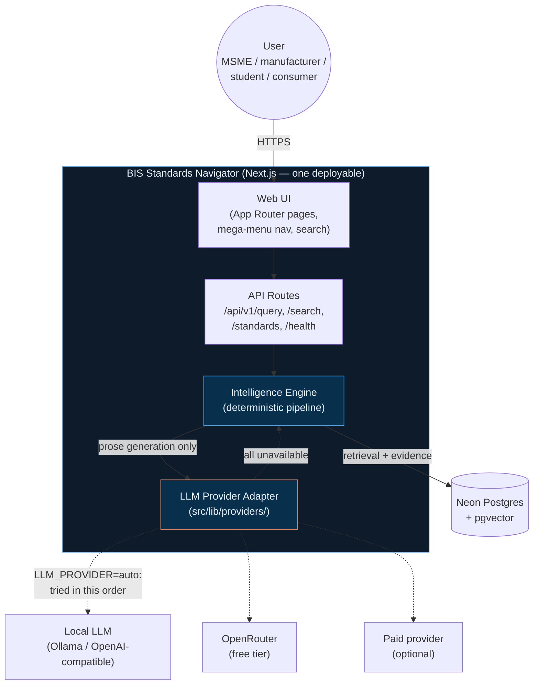
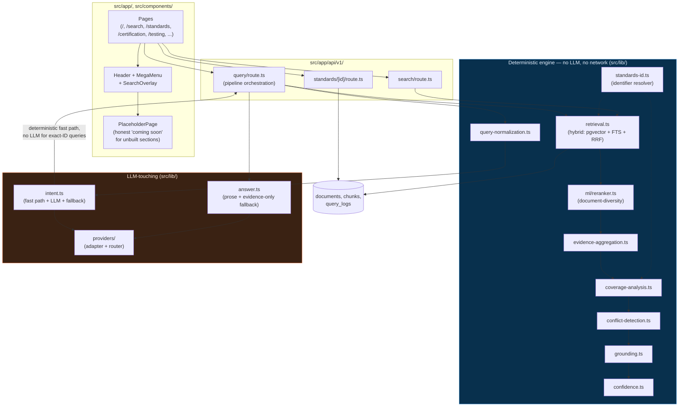
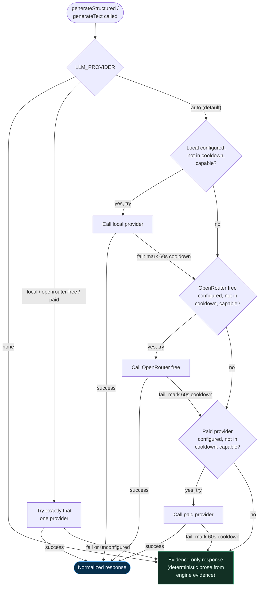
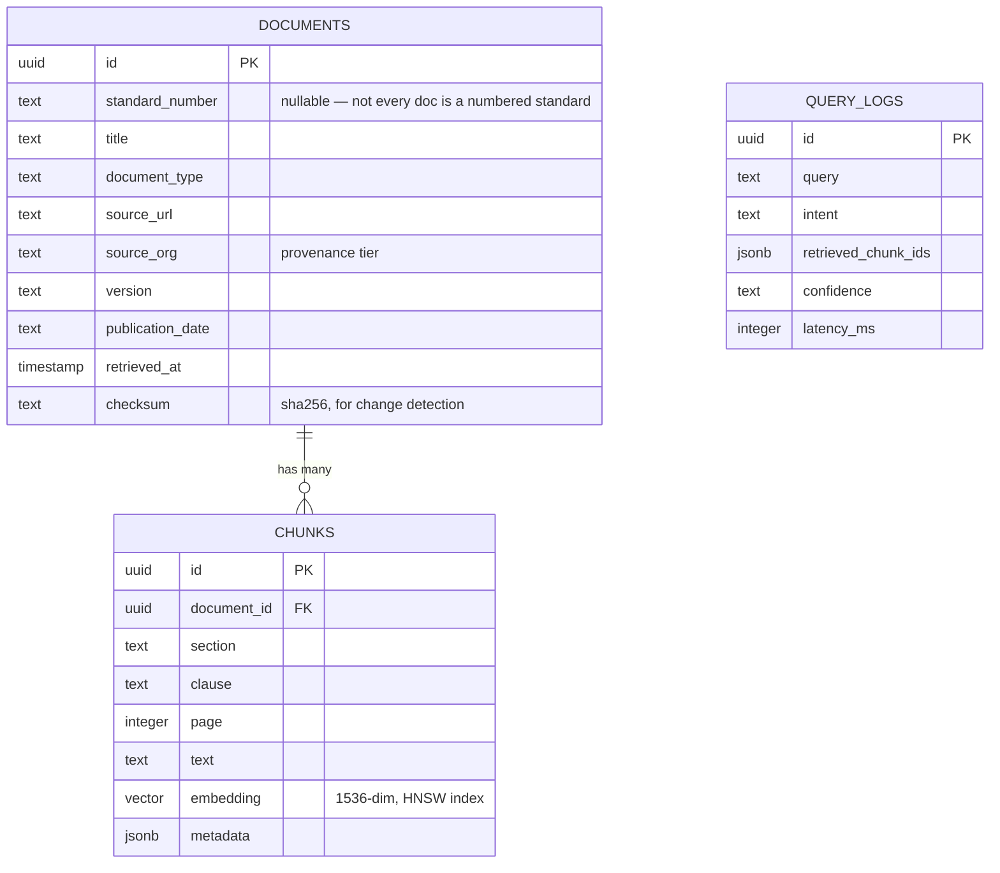
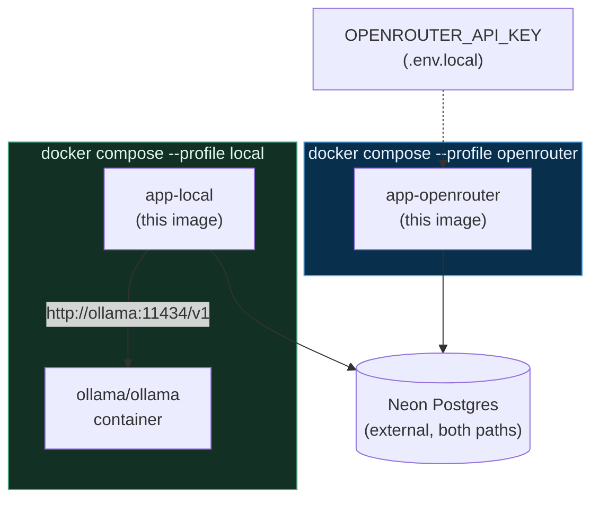

# High-Level Design — BIS Standards Navigator

Last updated: 2026-08-30. Diagrams reflect the architecture actually implemented and tested — cross-referenced against [`docs/ARCHITECTURE.md`](ARCHITECTURE.md), [`docs/ML_ENGINE.md`](ML_ENGINE.md), and [`docs/PROJECT_STATUS.md`](PROJECT_STATUS.md). Where something below is designed but not yet live-verified, it's called out — see those documents for the exact verification status of each piece.

---

## 1. System context

Who/what talks to the system, and what it depends on.

**Key property:** the dotted lines are all optional. `Engine` produces a complete, evidence-backed response using only `DB` — `Adapter` only adds natural-language prose on top, never new facts. See §4 below and [`docs/ARCHITECTURE.md`](ARCHITECTURE.md) for the fallback contract.

---

## 2. Component architecture

Where each responsibility lives in the codebase.

---

## 3. The intelligence pipeline (per query)

```mermaid
flowchart LR
    Q(["User query"]) --> N["Normalization<br/>(deterministic)"]
    N --> ID{"Exact standard<br/>ID + little else?"}
    ID -->|yes| FI["Fast-path intent<br/>NO LLM CALL"]
    ID -->|no| LI["Intent extraction<br/>(LLM, or deterministic<br/>keyword fallback)"]
    FI --> R
    LI --> R["Hybrid retrieval<br/>pgvector + Postgres FTS<br/>+ RRF fusion"]
    R --> RR["ML reranking<br/>(document-diversity,<br/>competitiveness-gated)"]
    RR --> EA["Evidence aggregation<br/>(per-standard, chunk-<br/>volume-bias resistant)"]
    EA --> CA["Coverage analysis<br/>(product/material/use-case/<br/>testing/certification/identifier)"]
    CA --> CD["Conflict detection<br/>(version, superseded,<br/>mandatory-vs-voluntary)"]
    CD --> GR["Deterministic grounding<br/>verified /<br/>supported_inference /<br/>insufficient_evidence"]
    GR --> EC["Deterministic<br/>engine confidence"]
    EC --> LLM["LLM prose generation<br/>(or evidence-only<br/>fallback if unavailable)"]
    LLM --> VAL["Standard-number +<br/>citation validation"]
    VAL --> RESP(["Grounded response"])

    style FI fill:#123024,stroke:#4fae87,color:#dff5ea
    style GR fill:#08304d,stroke:#5baef2,color:#e8f1ff
    style EC fill:#08304d,stroke:#5baef2,color:#e8f1ff
    style LLM fill:#3a2213,stroke:#f27c49,color:#ffe8db
```

**The critical invariant** (proven by test, not just designed — see [`docs/ML_ENGINE.md`](ML_ENGINE.md)): everything left of `LLM prose generation` is computed first and passed in as already-decided facts. The LLM's response schema has no field for `groundingState`, `confidence`, or citation identity — it physically cannot override them.

---

## 4. LLM provider fallback

**"Capable" =** `capabilities.structuredOutput` for structured calls only — text-only calls skip that check. No model is assumed capable by default; see [`docs/ARCHITECTURE.md`](ARCHITECTURE.md)'s verified allowlist. **Retry limit is 0 per provider** — a failure moves to the next provider, never retries the one that just failed.

---

## 5. Data model

`query_logs` is written on every `/api/v1/query` call but not yet read back for calibration — see [`docs/EVALUATION.md`](EVALUATION.md)'s calibration section ("insufficient data" is reported honestly rather than fabricated).

---

## 6. Deployment

Both profiles build from the same multi-stage `Dockerfile` (`next.config.ts`'s `output: "standalone"` keeps the final image to just the server bundle, not the full `node_modules` tree). Neither profile provisions a database — see the README's Quick Start.

**Verification status**: the OpenRouter path was built, run, and curl-verified live this session (real 200 on the homepage). The Ollama container itself was not started this session — see [`docs/PROJECT_STATUS.md`](PROJECT_STATUS.md)'s Docker section.

---

## 7. Design principles this HLD encodes

1. **Deterministic-first.** Every box in §3 left of "LLM prose generation" runs with no API key and no network call beyond Postgres. 45+23 tests prove this offline.
2. **The LLM is downstream of truth, never upstream of it.** It explains evidence; it does not select, verify, or score it.
3. **No hard dependency on any one provider — including "an LLM" at all.** §4's evidence-only terminus is not a degraded mode bolted on afterward; it's a first-class, tested response path.
4. **Every claim in this document is falsifiable.** Cross-reference [`docs/EVALUATION.md`](EVALUATION.md) for what was actually run and observed versus what is designed but unverified — this HLD does not upgrade a PLANNED item to DONE just because a diagram shows it.
